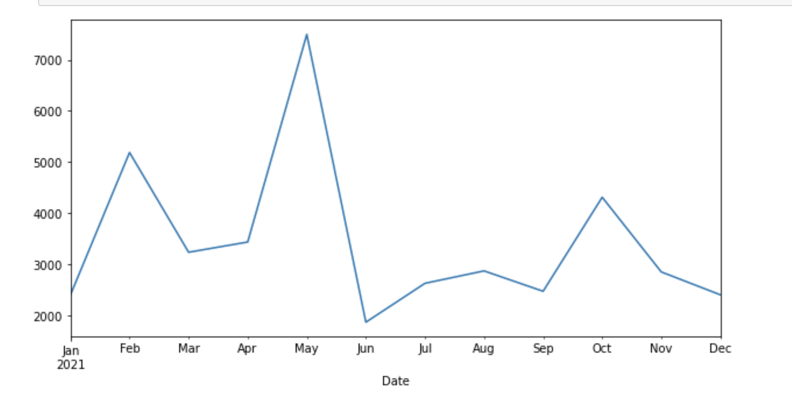
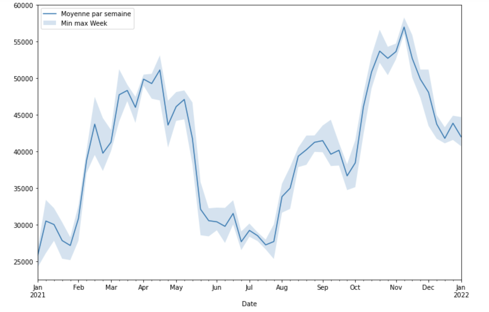

# Bitcoin

1. Récupérez les données dans le dossier Data sur les Bitcoin.

2. Créez un premier graphique plot sur la colonne Close.

Pour indiquez à Pandas que l'on souhaite définir nos index comme des dates modifiez les index numériques en date :

```python
index_col='Date',
parse_dates=True
```

3. Créez un graphique de l'évolution du Bitcoin en 2020

4. Etudiez maintenant l'évolution du Bitcoin entre 2000 et 2021

5. Utilisez la méthode resample pour regrouper les données par mois et étudier l'évolution du Bitcoin par mois sur l'année 2021.

6. Calculez la moyenne de la valeur du Bitcoin par mois sur l'année 2021. Utilisez la méthode mean.

7. Si on utilise la méthode std dans le code suivant, interprétez le sens de l'évolution du graphique.



8. Créez un graphique qui reprends sur l'année 2021 l'évolution du Bitcoin 

9. En utilisant la fonction **resmaple**, par semaine et la fonction aggregate créez un DataFrame des moyennes, écart-type et min/max. Utilisez plt.fill_between pour créez une zone d'incertitude autour du graphique des moyennes :



