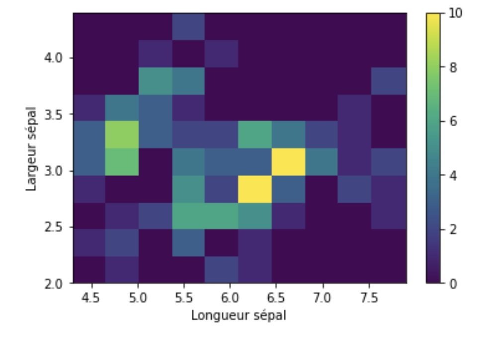

# Introduction

Un objectif de la Dataviz est de se représenter ou d'imaginer des choses abstraites, comme un fichier avec des données structurées, semi-structurées ou non structurées.

De mieux comprendre un problème et donc de mieux l'expliquer.

Deux approches existent pour utiliser la libreaire Matplotlib : une objet et une autre fonctionnelle avec plt.plot

## Approche fonctionnelle

## Cycle de vie d'un graphique

1. Création de la figure

D'abord vous créez l'espace dans lequel votre figure va se placer.

```python
plt.figure(figsize=(12,8))
```

2. Contenu

Définir le type de figure que vous souhaitez créer.

```python
plt.plot(x, x**2)
```

3. Ajouter d'autre figures

```python
plt.plot(x, x**2)
plt.plot(x, x**3)
```

4. Ajoutez des titre, label et légendes voir la disposition suivante

```python
plt.figure(figsize=(12,8))

plt.plot(x, x**2, label="quadratique", c='red', lw=2, ls='--')
plt.plot(x, x**3, label="cubique", c='black', lw=1, ls=':')

plt.title('Figures')

plt.xlabel('axe x')
plt.ylabel('axe y')

# On doit appeler cette fonction pour tracer la courbe
plt.legend()
plt.show()
```

5. Sauvegarde du graphique

```python
plt.savefig('my_fig.png')
```

## Grille

On peut également créer une grille de figures, on peut le voir comme un seul et même cycle pour nos figures.

```python
# row column 2*1 = 2 graphiques et numéro de la figure 1 et 2 dans l'exemple ci-dessous
plt.subplot(2, 1, 1)
plt.plot(x, x**2, label="quadratique", c='red')

plt.subplot(2, 1, 2)
plt.plot(x, x**3, label="quadratique", c='black')
```

## Approche objet pour les graphiques 

On peut également créer des graphiques avec l'approche objet, elle est plus souple et offre plus de possibilités.

- L'objet **ax** est un tableau **np.array** et l'attribut **sharex** permet de partager le même axe x des abscisses.


```python
fig, ax = plt.subplots(2,1, sharex=True)

# ax est un np.array 
ax[0].plot(x, x**2)
ax[1].plot(x, x**3)
```

## Quelques exemples

```python
import matplotlib.pyplot as plt
```

## 01 Exercice afficher plusieurs graphiques

Soit le dataset suivant, affichez sur un même graphique avec la méthode fonctionnelle ou objet les 8 graphiques.

```python
dataset = {f"tirage_{k}" : np.random.rand(100) for k in range(8) }
```


## plt.scatter

Problème de classification, nuage de points.

```python
import matplotlib.pyplot as plt
import numpy as np
from sklearn.datasets import load_iris

iris = load_iris()
```

- Dimension du datasets iris 

```python
# longueur, largeur des sépals et pétales
x = iris.data 

# classe 0 1 2 <=> d'iris
y = iris.target
names = list(iris.target_names)
```

## 02 Exercice nuage de points

1. Que représente le nuage de points suivants, complétez les légendes ci-dessous pour expliciter ce qu'elles représentent en fonction du datasets iris ?

```python
plt.scatter(x[:, 0], x[:,1], c=y)
plt.xlabel('')
plt.ylabel('')
```

2. Sachant que le paramètre **s** dans la fonction scatter représente la taille des points, modifiez le code ci-dessous pour que la taille des points soient fonction de la longueur des pétales.

```python
x[:,2]
plt.scatter(x[:, 0], x[:,1], c=y, alpha=.5, s = 2)
```

## Histogramme 1d

Il permet de voir comment son distribuer les variables.

- bins nombre de groupe(s)

- sur l'axe des x : valeur longueur de sépal

- sur l'axe y : nombre d'apparition de ces catégories.

```python
plt.hist(x[:,0], bins = 30)
```

## 02 Exercice fréquence 

Soit un lancer de 3 pièces de 1 euro, nous allons estimner la probabilité d'obtenir lors de ce lancer 2 piles exactement.

1. Créez une fonction qui simule le lancer de 3 pièces.

```python
# Fonction lancer de pièce(s)
def lancer(n = 3):
    return [ np.random.randint(0,2) for _ in range(n) ]
```

2. Calculez le nombre de fois que l'on obtient 2 piles exactement pour un lancer.

```python
sum( lancer() ) == 2
```

3. Répétez cette expérience aléatoire indépendante 1000 fois, et créez un histogramme calculant le nombre de fois que l'on obtient 0 pile, une fois pile, deux fois piles exactement et trois fois piles; faites un histogramme, pour représenter leurs fréquences d'apparition.

```python
exps = [ sum(lancer()) for _ in range(1_000) ]

plt.hist(
    exps, 
    align='mid', 
    edgecolor = 'black' 
);
```

Vérifiez que la probabilité est proche de ce que l'on pourrait calculer théoriquement :

```python
# avec notre simulation
exps.count(2)/1_000
# Théoriquement
(1/8)*3
```

## Histogramme 2d

Il permet de représenter une distribution de deux variables.

```python
plt.hist2(x[:,0], x[:, 1], cmap='Blues')
plt.xlabel('longueur sépal')
plt.ylabel('largeur sépal')
plt.colorbar()
``` 

- La couleur jaune, ici, indique la fréquence d'apparition la plus élévée par exemple.



## Pie chart

Diagramme circulaire

```python
explode = [0.0, 0.08, 0.0, 0.0,0.0,0.0]
colors = ['saddlebrown', 'wheat', 'crimson', 'lightgrey','lightblue','darkblue']

plt.pie(data, 
        explode=explode, 
        labels=labels, 
        colors=colors, 
        shadow=True)

plt.show()
```

Vous pouvez également créer plusieurs diagrammes circulaires dans la même figure :

```python
fig, axes = plt.subplots(1, 2, figsize=(10, 6))
ax1, ax2 = axes

colors = ['saddlebrown', 'wheat', 'crimson', 'lightgrey','lightblue','darkblue']
labels = ['Python','C','C++','PHP','Java','Ruby']

ax1.pie(data, labels=labels, colors=colors, startangle=90)
ax2.pie(data, labels=labels, colors=colors, startangle=90, counterclock=False)
ax1.set_title('Starting the plot at 90°')
ax2.set_title('Plotting clockwise')
plt.show()
```

## Analyse d'image

On peut également analyser la répartition des pixels sur une image.

```python
from scipy import misc
face = misc.face(gray=True)
plt.imshow(face, cmap='gray')
plt.hist(bins=255)
```