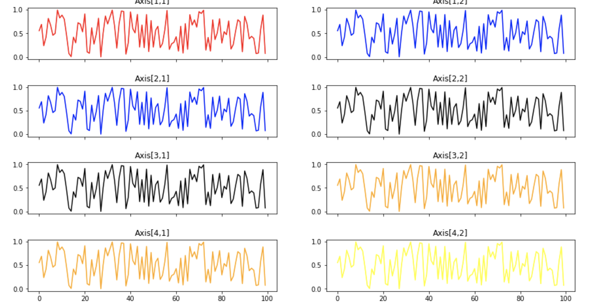

# Introduction

Un objectif de la Dataviz est de se représenter ou d'imaginer des choses abstraites. De mieux comprendre un problème et donc de mieux l'expliquer.

Deux approches existent pour utiliser la libreaire Matplotlib : une objet et une autre fonctionnelle avec plt.plot

## Approche fonctionnelle

## Cycle de vie d'un graphique

1. Création de la figure

```python
plt.figure(figsize=(12,8))
```

2. Contenu

```python
plt.plot(x, x**2)
```

3. Ajouter d'autre figures

```python
plt.plot(x, x**2)
plt.plot(x, x**3)
```

4. Ajoutez des titre, label et légendes

```python

plt.plot(x, x**2, label="quadratique")
plt.plot(x, x**3, label="cubique")

plt.title('Figure')

plt.xlabel('axe x')
plt.ylabel('axe y')

plt.legend()
plt.show()
```

5. Sauvegarde du graphique

```python
plt.savefig('my_fig.png')
```

## Grille

On peut également créer une grille de figures, on peut le voir comme une seule et même cycle de figures.

```python
plt.subplot(2, 1, 1)
plt.plot(x, x**2, label="quadratique", c='red')

plt.subplot(2, 1, 2)
plt.plot(x, x**3, label="quadratique", c='black')
```

## Approche objet pour les graphiques 

On peut également créer des graphiques avec l'approche objet, elle est plus souple et offre un peu plus de possibilités.


- L'objet ax est un tableau np.array et l'attribut **sharex** permet de partager le même axe x abscisses.

- ax est un tableau np.array

```python
fig, ax = plt.subplots(2,1, sharex=True)

ax[0].plot(x, x**2)
ax[1].plot(x, x**3)
```

## Quelques exemples

```python
import matplotlib.pyplot as plt
```

### Fonction puissance plot

```python
x = np.linspace(0,2,10)
# Vecteur de même dimension
y = x**2 

plt.plot(x, y)
plt.show()
``` 

On peut apporter des styles à notre courbe

- c couleur
- lw épaisseur du trait
- ls style du trait

```python
plt.plot(x, y, c='red', lw=1, ls'--');
```

## 01 Exercice afficher plusieurs graphiques

Soit le dataset suivant, affichez sur un même graphique avec la méthode fonctionnelle ou objet les différents graphiques.

```python
dataset = {f"tirage_{k}" : np.random.rand(100) for k in range(8) }
```




## plt.scatter

Problème de classification, nuage de points.

```python
import matplotlib.pyplot as plt
import numpy as np
from sklearn.datasets import load_iris

iris = load_iris()
```

- Dimension du datasets iris 

```python
# longueur, largeur des sépales et pétales
x = iris.data 

# classe 0 1 2 <=> d'iris
y = iris.target
names = list(iris.target_names)
```

## 02 Exercice nuage de points

1. Que représente le nuage de points suivants, complétez les légendes ci-dessous pour expliciter ce qu'elles représentent en fonction du datasets iris

```python
plt.scatter(x[:, 0], x[:,1], c=y)
plt.xlabel('')
plt.ylabel('')
```

2. Sachant que le paramètre **s** dans la fonction scatter représente la taille des points, modifiez le code ci-dessous pour que la taille des points soient fonction de la longueur des pétales

```python
plt.scatter(x[:, 0], x[:,1], c=y, alpha=.5, s = 100)
```

## Histogramme 1d

Il permet de voir comment son distribuer les variables.

- bins nombre de groupe(s)

- sur l'axe des x : valeur longueur de sépal

- sur l'axe y : nombre d'apparition de ces catégories.

```python
plt.hist(x[:,0], bins = 30)
```

## Histogramme 2d

Il permet de représenter une distribution de deux variables.

```python
plt.hist2(x[:,0], x[:, 1], cmap='Blues')
plt.xlabel('longueur sépal')
plt.ylabel('largeur sépal')
plt.colorbar()
``` 

- La couleur jaune, ici, indique la fréquence d'apparition la plus élévée par exemple.


## Analyse d'image

On peut également analyser la répartition des pixels sur une image.

```python
from scipy import misc
face = misc.face(gray=True)
plt.imshow(face, cmap='gray')
plt.hist(bins=255)
```